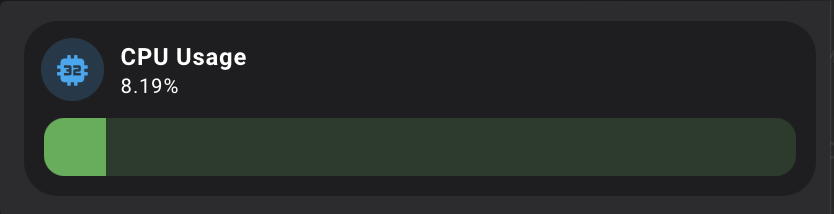
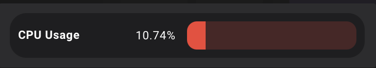
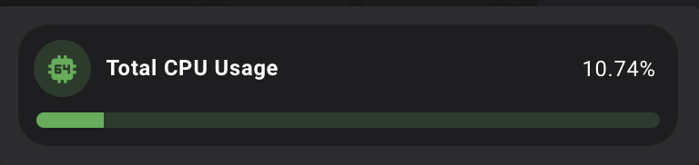

# Bar Sensor Card

Custom flexible Lovelace card for Home Assistant that combines a sensor icon, title, value, and a dynamic progress bar.  
The card supports **dynamic colors**, configurable bar position (bottom or right), inline value display, and flexible styling.  
Inspired by Mushroom-style cards.

---

## Installation

### HACS (recommended)
1. Go to **HACS → Frontend**
2. Click **+ Explore & Download Repositories**
3. Search for **Bar Sensor Card**
4. Install and add the resource to your dashboard configuration.

### Manual
1. Download the following files and place them inside your `www/` folder:
   - `dist/bar-sensor-card.js`
2. Add the resource to your `configuration.yaml` or Lovelace resources:

```yaml
resources:
  - url: /local/bar-sensor-card.js
    type: module
```

---

## Example Usage

```yaml
type: custom:bar-sensor-card
entity: sensor.temperature
title: Temperature
display_mode: both
bar_position: bottom
enable_dynamic_icon_color: true
enable_dynamic_bar_color: true
palette: red_to_green
show_value_inline: false
```

---

## Options

| Name                        | Type      | Default                                 | Description                                          |
|-----------------------------|-----------|------------------------------           |------------------------------------------------------|
| `entity`                    | string    | **required**                            | Entity id of the sensor to display.                  |
| `title`                     | string    | entity name                             | Custom title text.                                   |
| `icon`                      | string    | auto from device                        | Custom Material Design icon.                         |
| `display_mode`              | string    | `both`                                  | Display mode: `both`, `icon`, or `bar`.              |
| `bar_position`              | string    | `bottom`                                | Bar position: `bottom` or `right`.                   |
| `show_value_inline`         | boolean   | `false`                                 | If `true`, title and value are displayed in one row. |
| `decimals`                  | number    | `2`                                     | Number of decimal places for value.                  |
| `min`                       | number    | `0`                                     | Minimum value for percentage calculation.            |
| `max`                       | number    | `100`                                   | Maximum value for percentage calculation.            |
| `palette`                   | string    | `red_to_green`                          | Color palette used for dynamic colors (see below).   |
| `enable_dynamic_icon_color` | boolean   | `false`                                 | If `true`, icon color is based on sensor value.      |
| `enable_dynamic_bar_color`  | boolean   | `false`                                 | If `true`, bar color is based on sensor value.       |
| `icon_color`                | string    | `var(--rgb-accent-color)`               | Static color for icon if dynamic is disabled.        |
| `bar_color`                 | string    | `var(--rgb-accent-color)`               | Static color for bar if dynamic is disabled.         |
| `bar_height`                | number    | `42` (bottom) / `36` (right, max value) | Height of the bar in pixels.                         |
| `bar_border_radius`         | number    | `12`                                    | Border radius for the bar.                           |
| `tap_action`                | actionObj | `{action: more-info}`                   | Action on short tap.                                 |
| `hold_action`               | actionObj | `none`                                  | Action for long tap.                                 |
---

### actionObj
| Name               | Type      | Description                                  |
|--------------------|-----------|----------------------------------------------|
| `action`           | string    | Supports `more-info` or `perform-action`     |
| `perform_action`   | string    | Action to perform, only for `perform-action` |
| `target.entity_id` | string    | Target action entity                         |
---

**Example actions configuration block:**
```yaml
tap_action: none
hold_action:
  action: perform-action    
  perform_action: button.press  
  target:
    entity_id: button.indicator_blink
```

## Palettes

The following palettes are available in `constants.js`:

- `red_to_green`
- `green_to_red`

---

## Features
- ✅ Compact design, inspired by Mushroom cards  
- ✅ Dynamic color modes (icon and bar)  
- ✅ Flexible layouts: bar at the bottom or on the right  
- ✅ Inline or stacked title + value display  
- ✅ Fully customizable styling via config  

---

## Example Configurations

**Bar at the bottom:**

```yaml
type: custom:bar-sensor-card
entity: sensor.total_cpu_usage
icon: mdi:cpu-32-bit
bar_position: bottom
color: light-blue
enable_dynamic_bar_color: true
palette: green_to_red
```


**Bar on the right with inline value:**

```yaml
type: custom:bar-sensor-card
entity: sensor.total_cpu_usage
bar_position: right
enable_dynamic_bar_color: true
palette: red_to_green
display_mode: bar
show_value_inline: true
```


**Bar on the bottom with inline value, thin bar, bar and icon colors are both depend on sensor value:**
```yaml
type: custom:bar-sensor-card
entity: sensor.total_cpu_usage
bar_position: bottom
bar_height: 10
enable_dynamic_bar_color: true
enable_dynamic_icon_color: true
palette: green_to_red
display_mode: both
show_value_inline: true
```

